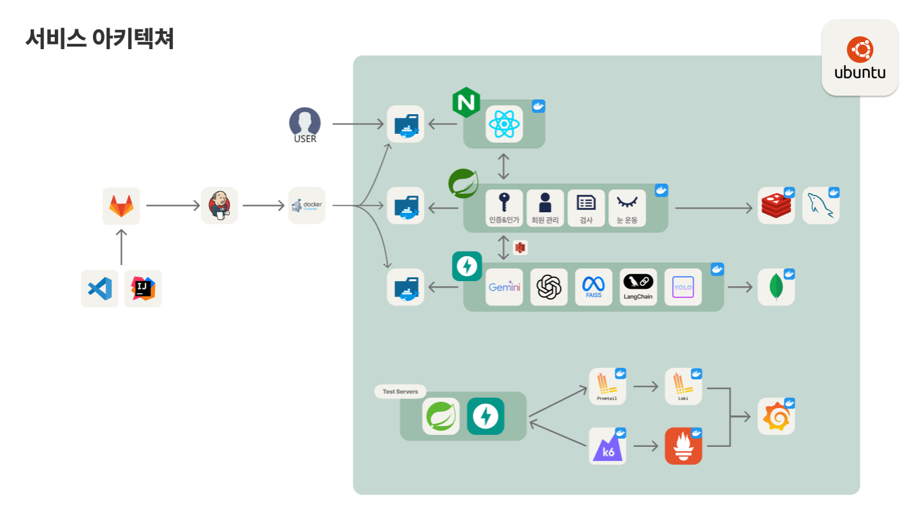

# PixmeUp
<div align="center">

</div>

###  **현대인의 눈 건강을 위한 AI 기반 예측 플랫폼**
> **PixmeUp**은 사용자의 눈 사진과 간단한 검사를 바탕으로 **AMD(황반변성)** 등 주요 안질환 위험도를 예측하고,사용자 맞춤형 **눈 운동 가이드**와 **질병 요약 리포트**를 제공하는 플랫폼입니다.  
전문 장비 없이도 집에서 손쉽게 눈 상태를 관리할 수 있도록 지원합니다.

<br/>

## 🚀 주요 기능

### 1. QR을 이용한 키오스크의 검사 결과 저장
### 2. 패스키를 활용한 간편 로그인
### 3. AI 예측 기능
  - 눈 사진 기반 안질환 예측 (YOLOv8 기반)
  - 다회 검사 기록을 활용한 시력 예측 (선형 회귀 기반)
  - 문진 결과 기반 AMD 위험도 예측 (AREDS Risk Model 적용)
  - 누적 검사 통합 리포트 및 질병별 요약
### 4. 눈 운동 가이드
  - GIF, TTS를 활용한 시청각 가이드 제공공
### 5. 신뢰도 기반 pseudo-label 재학습 파이프라인 자동화

<br/>

## ✨ 주요 화면 소개

### 1. 검사 결과 저장 및 리포트
<div align="center">

</div>
<br/>

### 2. AI 예측(AMD 예측 / 눈 질환 예측)
<div align="center">
  
  <span style="display:inline-block; width:10%;"></span>
  
</div>
<br/>


### 3. 눈 운동 
<div align="center">
  
  <span style="display:inline-block; width:10%;"></span>
  
</div>
<br/>

<br/>

## 🔍 시스템 아키텍처



<br/>

---

## 🛠️ 기술 스택

### 💻 프론트엔드

| 분류            | 기술                                                                                                                                                                                                                                                                                                                                                                                                                            | 설명                                                                     |
| --------------- | ------------------------------------------------------------------------------------------------------------------------------------------------------------------------------------------------------------------------------------------------------------------------------------------------------------------------------------------------------------------------------------------------------------------------------- | ------------------------------------------------------------------------ |
| 언어/프레임워크 |  <br/>  | 타입 안정성과 컴포넌트 기반 UI<br>시력 검사 기능 탑재 안드로이드 앱 개발 |
| 상태 관리       |                                                                                                                                                                                                                                                                                                                                  | 전역 상태 관리                                                           |
| 서버 상태       |                                                                                                                                                                                                                                                                                                               | API 요청/응답 캐싱 및 상태관리                                           |
| 스타일링        |                                                                                                                                                                                                                                            | 유틸리티 기반 CSS 및 UI 컴포넌트                                         |


### ⚙️ 백엔드 / AI

| 분류            | 기술                                                                                                                                                                                                                      | 설명                           |
| --------------- | ------------------------------------------------------------------------------------------------------------------------------------------------------------------------------------------------------------------------- | ------------------------------ |
| 언어/프레임워크 |                    | 백엔드 REST API 구현           |
| 데이터베이스    |                                      | 사용자 정보 및 세션 캐시 저장  |
| 보안/인증       |   | JWT 기반 인증/인가 처리        |
| ORM             |                                                                                                                                                                 | JPA 활용 데이터 접근           |
| AI 서버 연동    |                             | FastAPI 기반 AI 진단 서버 연동 |
| AI 모델         |                                                                                                                                                           |

### ☁️ 공통 인프라 및 협업 도구

| 분류          | 기술                                                                                                                                                                                                                                                                                   | 설명                                    |
| ------------- | -------------------------------------------------------------------------------------------------------------------------------------------------------------------------------------------------------------------------------------------------------------------------------------- | --------------------------------------- |
| 파일 저장     |                                                                                                                                                                                    | 사용자 이미지, 라벨, 모델 가중치 저장   |
| 배포 & 인프라 |    | EC2, RDS, S3, 리버스 프록시, 컨테이너화 |
| CI/CD         |                                                                                                                                                                                         | Jenkins 기반 빌드/배포 자동화           |
| 협업/관리     |                                                                                                             | 형상관리 및 이슈 관리                   |
| 문서화        |                                                                                                                                                                                         |

<br/>

## 📁 주요 디렉토리 구조

```
backend/
├── src/main/java/com/corp/pixelro
│   ├── check/              # 검사 관련 도메인
│   ├── survey/             # 문진 관련
│   ├── external/           # FastAPI 통신
│   ├── global/             # 공통 설정, 예외처리
│   └── user/               # 사용자 및 인증
fastapi-app/
├── app/
│   ├── api/                # /predict API
│   ├── services/           # 예측 로직
│   ├── models/             # 모델 및 가중치
│   └── schemas/            # 요청/응답 정의
```

<br/>

## 📘 API 문서
> ### [Swagger UI](http://localhost:8088/api/v1/swagger-ui.html)

<br/>


## 👨‍👩‍👧‍👦 팀원 소개

| 이름   | 역할                   | GitHub                                                 |
| ------ | ---------------------- | ------------------------------------------------------ |
| 김종명 | 팀장 / 프론트엔드 개발 | [github.com/jump6746](https://github.com/jump6746)     |
| 차윤영 | 백엔드 팀장            | [github.com/yuncof](https://github.com/yuncof)         |
| 배성훈 | 백엔드 개발            | [github.com/baehoonbae](https://github.com/baehoonbae) |
| 이동욱 | 백엔드 개발            | [github.com/2Ludy](https://github.com/2Ludy)           |
| 오은지 | 프론트엔드 개발        | [github.com/oille12](https://github.com/oille12)       |
| 윤이영 | 프론트엔드 개발        | [github.com/y20ng](https://github.com/y20ng)           |

---


## 📄 라이선스

```
본 프로젝트는 교육 과정의 일환으로 제작된 비상업적 프로젝트입니다.
상업적 목적의 사용을 금지합니다.

```

© 2025 PixmeUp. All Rights Reserved.


